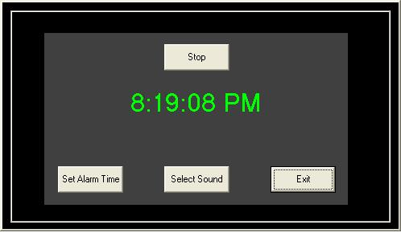



## Alarmy II

### Description

An alarm clock which you select your own .wav, .mp3, or .wma file to be the noise of the alarm!

PLEASE VOTE EVEN IF YOU DONT LIKE IT!!!!!
 
### More Info
 

             |
---                |---
**Submitted On**   |2002-12-19 19:59:20
**By**             |[Timothy E\. Mertz](https://github.com/Planet-Source-Code/PSCIndex/blob/master/ByAuthor/timothy-e-mertz.md)
**Level**          |Beginner
**User Rating**    |3.7 (11 globes from 3 users)
**Compatibility**  |VB 3\.0, VB 4\.0 \(16\-bit\), VB 4\.0 \(32\-bit\), VB 5\.0, VB 6\.0
**Category**       |[Miscellaneous](https://github.com/Planet-Source-Code/PSCIndex/blob/master/ByCategory/miscellaneous__1-1.md)
**World**          |[Visual Basic](https://github.com/Planet-Source-Code/PSCIndex/blob/master/ByWorld/visual-basic.md)
**Archive File**   |[Alarmy\_II15201012292002\.zip](https://github.com/Planet-Source-Code/timothy-e-mertz-alarmy-ii__1-41970/archive/master.zip)

